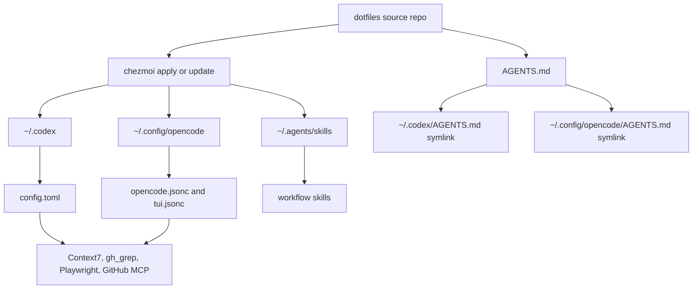

# Agent Workflow Dotfiles

## Navigation

- [Overview](#overview)
- [How It Fits Together](#how-it-fits-together)
- [Agent Workflow](#agent-workflow)
- [Skill Catalog](#skill-catalog)
- [MCP Servers](#mcp-servers)
- [Setup](#setup)
- [Daily Maintenance](#daily-maintenance)
- [Repository Map](#repository-map)
- [Chezmoi Notes](#chezmoi-notes)

## Overview

This repository is a chezmoi-managed global configuration for coding agents. It installs shared instructions, reusable skills, and MCP server configuration for Codex and OpenCode so both tools follow the same workflow.

The important idea is separation of scope:

- This repo owns global agent behavior and tool configuration.
- Individual projects own their own `README.md`, `AGENTS.md`, `ARCHITECTURE.md`, and `DESIGN.md`.
- The global skills in this repo help agents create and maintain those project-scope files.

Root `README.md` is for humans. Root `AGENTS.md` is the shared operating manual for agents and is symlinked into the configured agent tools.

## How It Fits Together



After applying the repo, Codex and OpenCode both point at the same global `AGENTS.md`. The skills live in `~/.agents/skills`, making them available as reusable workflows for project work.

## Agent Workflow

The global workflow is:

1. Ground in the target project before changing anything.
2. State assumptions, tradeoffs, and success criteria.
3. Use the right skill or MCP only when it fits the task.
4. Make the smallest change that solves the problem.
5. Verify with focused checks.
6. Report what changed, what was verified, and what remains uncertain.

Project-scope documentation follows this ownership model:

| File              | Scope         | Owns                                                            |
| ----------------- | ------------- | --------------------------------------------------------------- |
| `README.md`       | Project       | Human overview, setup, usage, and navigation                    |
| `AGENTS.md`       | Project       | Repo-specific agent instructions and workflow constraints       |
| `ARCHITECTURE.md` | Project       | Stack, system structure, data flow, integrations, and tradeoffs |
| `DESIGN.md`       | Project       | Visual identity, design tokens, UI rules, and interaction feel  |

This global configuration repo intentionally does not have root `ARCHITECTURE.md` or `DESIGN.md` files.

## Skill Catalog

Agents choose skills from the skill name and frontmatter `description`, because that metadata is visible before the skill body is loaded.

| Skill                | Description |
| -------------------- | ----------- |
| `brainstorm`         | Refine rough product ideas through concept-level questioning before implementation planning. |
| `setup`              | Coordinate project documentation setup across `DESIGN.md`, `ARCHITECTURE.md`, `README.md`, and `AGENTS.md`. |
| `write-design`       | Create or update `DESIGN.md` with visual identity, design tokens, component styling, and interaction guidance. |
| `write-architecture` | Create or update `ARCHITECTURE.md` with project technology, system structure, data flow, integrations, and tradeoffs. |
| `write-readme`       | Create or update a human-facing project `README.md` with overview, setup, usage, and navigation. |
| `write-agents`       | Create or update a project `AGENTS.md` with concise, repo-specific operating instructions for coding agents. |
| `frontend-design`    | Build or improve frontend interfaces with strong visual quality and project-appropriate design. |
| `audit`              | Perform a read-only pre-deployment review for security, correctness, spec alignment, and code quality. |
| `md-table-formatter` | Format Markdown tables so columns are aligned and readable. |
| `find-skills`        | Discover, compare, vet, and optionally help install external agent skills. |
| `find-mcps`          | Discover, compare, vet, and optionally help install Model Context Protocol servers or connectors. |
| `commit`             | Create a git commit with a message based on the actual diff when the user explicitly asks for a commit. |
| `handoff`            | Create a concise handoff document when the user explicitly asks another agent or future session to continue the work. |

## MCP Servers

Both Codex and OpenCode are configured with the same MCP capabilities:

| MCP          | Purpose                                                       |
| ------------ | ------------------------------------------------------------- |
| `context7`   | Current library and framework documentation                   |
| `gh_grep`    | Real-world code examples from public GitHub repositories      |
| `playwright` | Browser automation, UI checks, and end-to-end verification    |
| `github`     | GitHub API workflows when the user authorizes repository work |

The MCP configuration is documented here, but the actual values live in:

- `dot_codex/config.toml`
- `dot_config/opencode/opencode.jsonc`

## Setup

Install chezmoi:

```bash
# macOS
brew install chezmoi

# Linux
sh -c "$(curl -fsLS get.chezmoi.io)" -- -b ~/.local/bin

# Windows
winget install twpayne.chezmoi
```

Initialize and apply this source repo:

```bash
chezmoi init --apply https://github.com/kaufmann-dev/dotfiles.git
```

For an existing local clone:

```bash
cd path/to/dotfiles
chezmoi init --source-path .
chezmoi apply
```

## Daily Maintenance

| Command              | Purpose                                             |
| -------------------- | --------------------------------------------------- |
| `chezmoi diff`       | Preview changes before applying them                |
| `chezmoi apply`      | Apply source changes to the home directory          |
| `chezmoi edit <file>` | Edit a managed target file through the source repo |
| `chezmoi re-add`     | Pull target-file changes back into the source repo  |
| `chezmoi update`     | Pull the latest repo changes and apply them         |

When changing this repository directly, edit the source files here and then run `chezmoi diff` or `chezmoi apply` from the source directory.

## Repository Map

```text
dotfiles/
|-- AGENTS.md
|-- README.md
|-- .chezmoiignore
|-- dot_agents/
|   `-- skills/
|       |-- brainstorm/
|       |-- setup/
|       |-- write-design/
|       |-- write-architecture/
|       |-- write-readme/
|       |-- write-agents/
|       |-- frontend-design/
|       |-- audit/
|       |-- find-skills/
|       |-- find-mcps/
|       |-- md-table-formatter/
|       |-- commit/
|       `-- handoff/
|-- dot_codex/
|   |-- config.toml
|   `-- symlink_AGENTS.md.tmpl
`-- dot_config/
    `-- opencode/
        |-- opencode.jsonc
        |-- tui.jsonc
        `-- symlink_AGENTS.md.tmpl
```

Chezmoi maps these source paths into the home directory:

| Source path                                | Destination                                      |
| ------------------------------------------ | ------------------------------------------------ |
| `dot_agents/skills`                        | `~/.agents/skills`                               |
| `dot_codex/config.toml`                    | `~/.codex/config.toml`                           |
| `dot_codex/symlink_AGENTS.md.tmpl`         | `~/.codex/AGENTS.md` symlink                     |
| `dot_config/opencode/opencode.jsonc`       | `~/.config/opencode/opencode.jsonc`              |
| `dot_config/opencode/tui.jsonc`            | `~/.config/opencode/tui.jsonc`                   |
| `dot_config/opencode/symlink_AGENTS.md.tmpl` | `~/.config/opencode/AGENTS.md` symlink         |

## Chezmoi Notes

Chezmoi translates source prefixes before applying files:

| Prefix        | Meaning                                      |
| ------------- | -------------------------------------------- |
| `dot_`        | Creates a hidden file or directory           |
| `symlink_`    | Creates a symlink instead of a regular file  |
| `private_`    | Applies private file permissions             |
| `executable_` | Marks the target file executable             |
| `literal_`    | Removes the prefix without special handling  |

`.chezmoiignore` excludes `README.md` files from being applied into the home directory. The root README is documentation for this source repo, not a managed home file.
